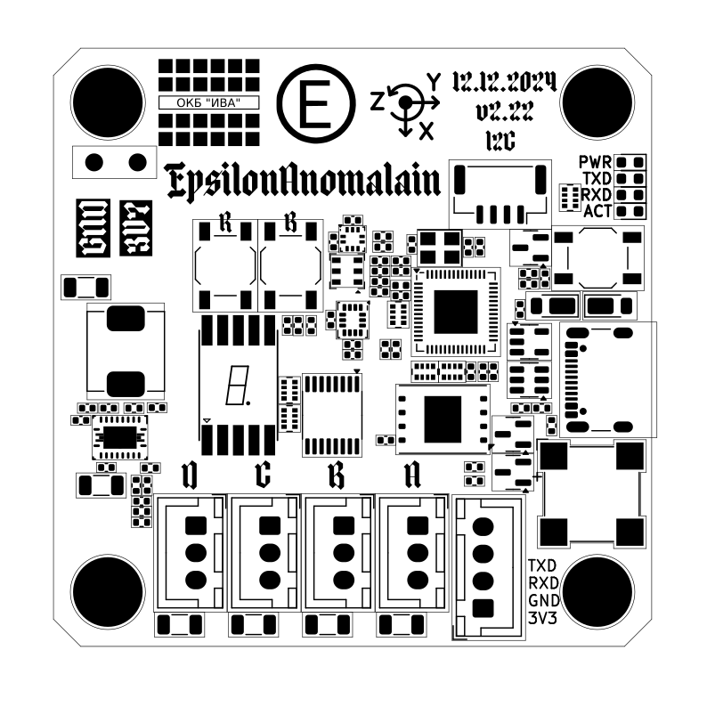
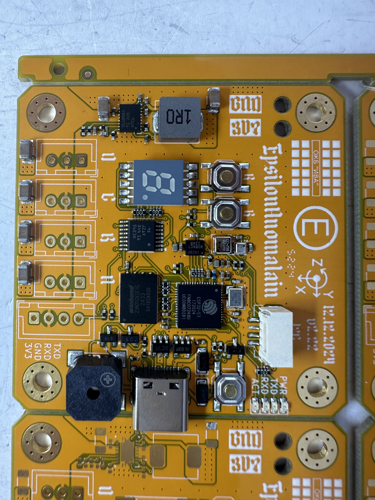

# Barsotion GBK EpsilonAnomalain
Board computer for model rockets, the 10th board after Berkut

## ⚡️Manual
- [EA&TA_user_manual_revD.pdf (newest revision)](https://github.com/Barsy-Barsevich/Barsotion-TA/Manual/EA&TA_user_manual_revD.pdf)
- [EA&TA_user_manual_revC.pdf](https://github.com/Barsy-Barsevich/Barsotion-TA/Manual/EA&TA_user_manual_revC.pdf)
- [EA&TA_user_manual_preliminary_edition_revB.pdf](https://github.com/Barsy-Barsevich/Barsotion-TA/Manual/EA&TA_user_manual_preliminary_edition_revB.pdf)
- [EA&TA_user_manual_preliminary_edition_revA.pdf](https://github.com/Barsy-Barsevich/Barsotion-TA/Manual/EA&TA_user_manual_preliminary_edition_revA.pdf)

## ⚡️Software
- [EA/TA software packet](https://github.com/Barsy-Barsevich/Barsotion-xA-software)

## ⚡️Continious progress
- [Previous version: Barsotion GBK DeltaAnomalain](https://github.com/Barsy-Barsevich/Barsotion-GBK-DeltaAnomalain)
- [Next version: Barsotion-TA (ThetaAnomalain)](https://github.com/Barsy-Barsevich/Barsotion-TA)

## ⚡️Schematic

## ⚡️Parameters
- Microcontroller: ESP32-S3FN8 (2x Xtensa LX7 core)
- Clock frequency: 240MHz
- Gyroscope: on-board ICM-42688-P (SPI, interrupt channel)
- Barometer: on-board, BMP388 (I2C)
- Hygrometer: on-board, AHT20 (I2C)
- Memory: 1Gbit SPI NAND Flash W25N04GVZEIG (Quad SPI)

